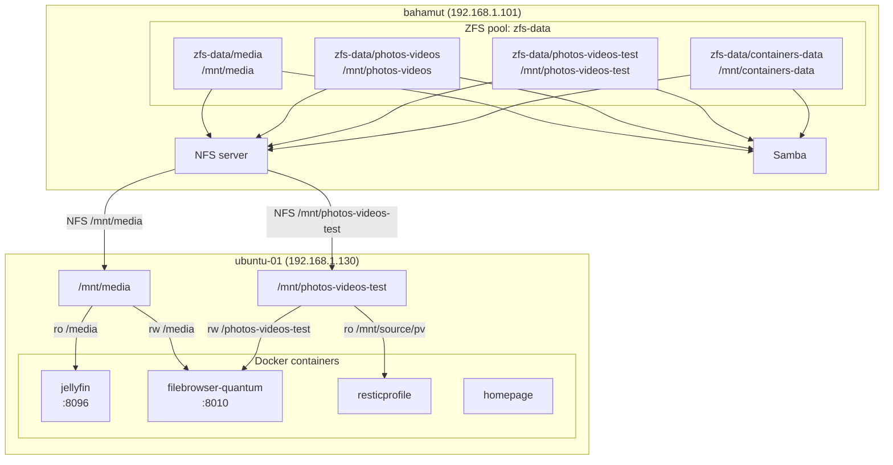

# Storage

## Architecture

## ZFS Datasets (bahamut)

Pool: `zfs-data`

| Dataset | Mount point | Purpose |
|---|---|---|
| `zfs-data/media` | `/mnt/media` | Jellyfin media library (movies, TV shows, music) |
| `zfs-data/photos-videos` | `/mnt/photos-videos` | Primary photos and videos collection |
| `zfs-data/photos-videos-test` | `/mnt/photos-videos-test` | Test dataset for backup validation |
| `zfs-data/containers-data` | `/mnt/containers-data` | Persistent data for Docker containers |

All datasets are owned by uid/gid `1000` (ubuntu user).

Managed by: `ansible/roles/fileserver_zfs` with vars in `ansible/host_vars/bahamut.yml`.

---

## Sharing

### NFS (bahamut → LAN)

All datasets are exported via NFS to the whole LAN (`192.168.1.0/24`) with `rw,sync,all_squash` (mapped to uid/gid 1000).

| Export path | Accessible by |
|---|---|
| `/mnt/media` | any host on 192.168.1.0/24 |
| `/mnt/photos-videos` | any host on 192.168.1.0/24 |
| `/mnt/photos-videos-test` | any host on 192.168.1.0/24 |
| `/mnt/containers-data` | any host on 192.168.1.0/24 |

Managed by: `ansible/roles/fileserver_nfs`.

### Samba (bahamut → LAN)

All datasets are shared via Samba under the same names, authenticated by a single Samba user (`FILESERVER_SMB_USER`).

| Share name | Path |
|---|---|
| `media` | `/mnt/media` |
| `photos-videos` | `/mnt/photos-videos` |
| `photos-videos-test` | `/mnt/photos-videos-test` |
| `containers-data` | `/mnt/containers-data` |

Managed by: `ansible/roles/fileserver_samba`.

---

## Mounts on ubuntu-01 (192.168.1.130)

| Source (bahamut) | Mount point | Automated |
|---|---|---|
| `192.168.1.101:/mnt/photos-videos-test` | `/mnt/photos-videos-test` | `ansible/roles/nfs_client` |
| `192.168.1.101:/mnt/media` | `/mnt/media` | `ansible/roles/nfs_client` |

### Consumers on ubuntu-01

| Container | Dataset used | Mount in container | Mode |
|---|---|---|---|
| `resticprofile` | `photos-videos-test` | `/mnt/source/pv` | read-only |
| `jellyfin` | `media` | `/media` | read-only |
| `filebrowser-quantum` | `media` | `/media` | read-write |
| `filebrowser-quantum` | `photos-videos-test` | `/photos-videos-test` | read-write |
